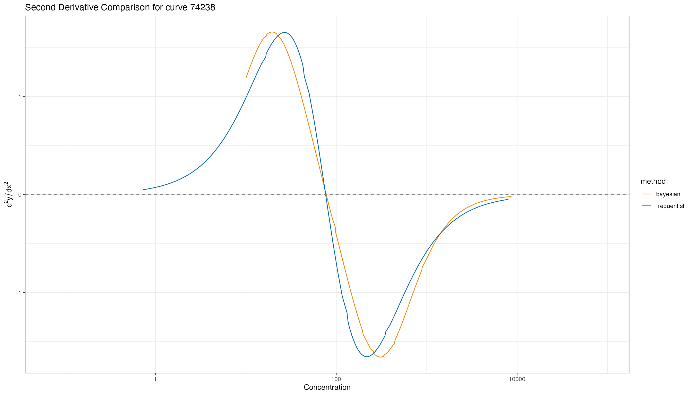
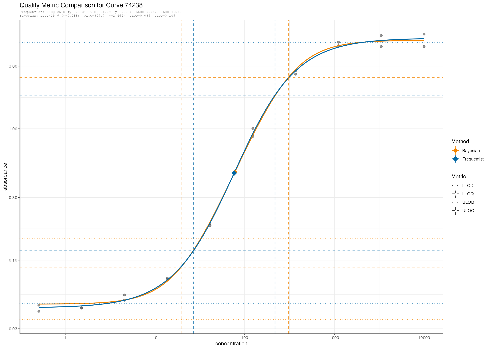

# Computing Standard Curve Quality Control Metrics using curveRmetrics

## Overview

This vignette demonstrates the end-to-end `curveRmetrics` workflow for
evaluating standarded curve quality. Starting from raw Frequentist and
Bayesian curve fits stored in a database, we derive a standardized set
of Quality Control (QC) metrics:

- **Inflection point** — The point on the standard curve where the
  concavity transitions from concave up to concave down. It is the point
  where the assay is most sensitive to measurement errors in the
  measured response of the assay.

- **Assay sensitivity** — Measured by the slope of the inflection point.

- **Limits of Detection (LODs)** — Lower and upper LODs are defined as
  the upper 97.5% confidence bound of the lower asymptote and the lower
  2.5% confidence bound of the upper asymptote, respectively (Rajam et
  al.).

- **Reliable Detection Limits (RDLs)** - Lower RDL: The lowest
  concentration at which the assay consistently produces a signal above
  background with 95% confidence based on the fit of the standard curve
  (Rajam et al.). Upper RDL: Analogously, the highest concentration at
  which the assay consistently produces a signal below the upper
  asymptote (saturation) with 95% confidence, based on the fit of the
  standard curve.

- **Minimum Detectable Concentration** - The smallest antibody
  concentration that produces a signal the assay can detect above
  background (Rajam et al.). This corresponds to the x-coordinate of the
  Lower Limit of Detection in the legend, as it is on the concentration
  axis.

- **Limits of Quantification (LOQ)** - Defines a region of assay
  response (MFI) and concentration where sample estimates have less
  measurement error. Limits of Quantification are derived from the local
  minimum and maximum of the second derivative of x given y of the
  standard curve (Daly et al.), (Jeanne L Sebaugh and P. D. McCray) ,
  (Sanz et al.).

All metrics are computed in natural (back-transformed) parameter units
so that results are directly interpretable and comparable across fitting
methods.

## Setup: Load Curve Data from Database

We load Frequentist and Bayesian curve fits for the `curveTest2` study
containing data from ELISA immunoassays, along with their parameter
confidence/credible intervals and assay standards. Other studies or
similar fit data from standard curves can be used as input as long as
they follow the functional forms from accompanying `curveRfreq` or
`stanassay` R packages. Curve fits from multiplex bead arrays and other
immunoassays with a standard curve can be used.

``` r
devtools::load_all()
#> ℹ Loading curveRmetrics
script_path <- system.file("vignette_helpers", "db_functions.R", package = "curveRmetrics")
if (file.exists(script_path)) {
  source(script_path)
} else {
  warning("Script file not found at expected path: ", script_path)
}
#> Warning: package 'dplyr' was built under R version 4.4.3
#> 
#> Attaching package: 'dplyr'
#> 
#> The following objects are masked from 'package:stats':
#> 
#>     filter, lag
#> 
#> The following objects are masked from 'package:base':
#> 
#>     intersect, setdiff, setequal, union
conn <- get_db_connection()

freq_curves_df  <- get_freq_curves(conn, "curveTest2")
bayes_curves_df <- get_bayes_curves(conn, "curveTest2")
bayes_param_ci_df <- get_bayes_param_ci(conn, "curveTest2")
freq_param_ci_df <- get_freq_parameters(conn, "curveTest2")
standards <- get_standards(conn, "curveTest2")
```

Curve fit results from both Frequentist and Bayesian fitting methods are
combined into a single data frame so that all downstream QC functions
operate on Frequentist and Bayesian curves simultaneously, enabling
direct method comparisons.

``` r
# combine both the Frequentest and Bayesian curves together for quality metrics
# calculations and comparisons. 
curves_df <- rbind(freq_curves_df, bayes_curves_df)
# naturalize the parameters
curves_nat <- curves_df %>%
  transform_to_natural_units()

head(curves_nat)
#> # A tibble: 6 × 13
#>   curve_id method model_name     a     b     c      d      g  c_nat b_nat  a_nat
#>    <int64> <chr>  <chr>      <dbl> <dbl> <dbl>  <dbl>  <dbl>  <dbl> <dbl>  <dbl>
#> 1    74233 frequ… logistic4  -1.31 0.288  1.89  0.528 NA       78.2 0.663 0.0487
#> 2    74234 frequ… logistic5  -1.47 0.156  2.56 -0.558  0.166  364.  0.358 0.0338
#> 3    74236 frequ… loglogist… -1.40 3      2.02  0.726  1.42   104.  6.91  0.0403
#> 4    74235 frequ… logistic4  -1.47 0.504  3.45 -1.000 NA     2811.  1.16  0.0336
#> 5    74238 frequ… logistic4  -1.36 0.346  1.88  0.690 NA       76.4 0.796 0.0433
#> 6    74237 frequ… logistic4  -1.46 0.373  3.47 -0.784 NA     2931.  0.859 0.0346
#> # ℹ 2 more variables: d_nat <dbl>, g_nat <dbl>
```

**Note:**
[`transform_to_natural_units()`](https://immunoplex.github.io/curveRmetrics/reference/transform_to_natural_units.md)
back-transforms four curve parameters (`a`, `b`, `c`, `d`) from their
fitted scales to natural units.

Select a specific `curve_id` to visualize comparisons. The
`curveRmetrics` package will compute Quality Control (QC) metrics for
each `curve_id` in the naturalized parameter set (`curves_nat`).

The `verbose` argument in the `curveRmetrics` shows QC output messages.
To hide these messages set `verbose` to `FALSE`.

## Compute Inflection Point

``` r
nat_params <- compute_inflection_point(curves_nat, verbose = F)
head(nat_params)
#> # A tibble: 6 × 15
#>   curve_id method model_name     a     b     c      d      g  c_nat b_nat  a_nat
#>    <int64> <chr>  <chr>      <dbl> <dbl> <dbl>  <dbl>  <dbl>  <dbl> <dbl>  <dbl>
#> 1    74233 frequ… logistic4  -1.31 0.288  1.89  0.528 NA       78.2 0.663 0.0487
#> 2    74234 frequ… logistic5  -1.47 0.156  2.56 -0.558  0.166  364.  0.358 0.0338
#> 3    74236 frequ… loglogist… -1.40 3      2.02  0.726  1.42   104.  6.91  0.0403
#> 4    74235 frequ… logistic4  -1.47 0.504  3.45 -1.000 NA     2811.  1.16  0.0336
#> 5    74238 frequ… logistic4  -1.36 0.346  1.88  0.690 NA       76.4 0.796 0.0433
#> 6    74237 frequ… logistic4  -1.46 0.373  3.47 -0.784 NA     2931.  0.859 0.0346
#> # ℹ 4 more variables: d_nat <dbl>, g_nat <dbl>, inflect_x <dbl>,
#> #   inflect_y <dbl>
```

## Assay Sensitivity

``` r
nat_sens <- compute_assay_sensitivity(nat_params, verbose = T)
#> [compute_assay_sensitivity] curve_id=74233 (frequentist)  inflect_x=78.2191  dydx=1.253867
#> [compute_assay_sensitivity] curve_id=74234 (frequentist)  inflect_x=1623.8193  dydx=0.000000
#> [compute_assay_sensitivity] curve_id=74236 (frequentist)  inflect_x=98.9211  dydx=0.000000
#> [compute_assay_sensitivity] curve_id=74235 (frequentist)  inflect_x=2811.1083  dydx=0.014327
#> [compute_assay_sensitivity] curve_id=74238 (frequentist)  inflect_x=76.4405  dydx=1.525534
#> [compute_assay_sensitivity] curve_id=74237 (frequentist)  inflect_x=2931.4238  dydx=0.037745
#> [compute_assay_sensitivity] curve_id=74240 (frequentist)  inflect_x=80.8552  dydx=1.472967
#> [compute_assay_sensitivity] curve_id=74239 (frequentist)  inflect_x=1177.1242  dydx=0.000000
#> [compute_assay_sensitivity] curve_id=74241 (frequentist)  inflect_x=78.8170  dydx=1.284726
#> [compute_assay_sensitivity] curve_id=74242 (frequentist)  inflect_x=1921.4982  dydx=0.000000
#> [compute_assay_sensitivity] curve_id=74233 (bayesian)  inflect_x=78.7953  dydx=0.000000
#> [compute_assay_sensitivity] curve_id=74234 (bayesian)  inflect_x=1629.3557  dydx=0.000000
#> [compute_assay_sensitivity] curve_id=74235 (bayesian)  inflect_x=9079.8828  dydx=0.000000
#> [compute_assay_sensitivity] curve_id=74236 (bayesian)  inflect_x=93.3025  dydx=0.000000
#> [compute_assay_sensitivity] curve_id=74237 (bayesian)  inflect_x=4720.8039  dydx=0.000000
#> [compute_assay_sensitivity] curve_id=74238 (bayesian)  inflect_x=77.5913  dydx=0.000000
#> [compute_assay_sensitivity] curve_id=74239 (bayesian)  inflect_x=1949.2585  dydx=0.000000
#> [compute_assay_sensitivity] curve_id=74240 (bayesian)  inflect_x=79.5490  dydx=0.000000
#> [compute_assay_sensitivity] curve_id=74241 (bayesian)  inflect_x=97.3891  dydx=0.000000
#> [compute_assay_sensitivity] curve_id=74242 (bayesian)  inflect_x=1421.1457  dydx=0.000000
#> [compute_assay_sensitivity] curve_id=75375 (bayesian)  inflect_x=54.9780  dydx=0.000000
#> [compute_assay_sensitivity] curve_id=75376 (bayesian)  inflect_x=62.1056  dydx=0.000000
#> [compute_assay_sensitivity] curve_id=75377 (bayesian)  inflect_x=52.1438  dydx=0.000000
#> [compute_assay_sensitivity] curve_id=75378 (bayesian)  inflect_x=55.9594  dydx=0.000000
#> [compute_assay_sensitivity] curve_id=75379 (bayesian)  inflect_x=66.5617  dydx=0.000000
head(nat_sens)
#> # A tibble: 6 × 4
#>   curve_id method      inflect_x dydx_inflect
#>    <int64> <chr>           <dbl>        <dbl>
#> 1    74233 frequentist      78.2     1.25e+ 0
#> 2    74234 frequentist    1624.      0       
#> 3    74236 frequentist      98.9     3.37e-11
#> 4    74235 frequentist    2811.      1.43e- 2
#> 5    74238 frequentist      76.4     1.53e+ 0
#> 6    74237 frequentist    2931.      3.77e- 2
```

## Limits of Detection

First the raw confidence/credible intervals and parameters are
transformed to natural units and combined together in one dataset for
comparison.

``` r
bayes_param_ci_nat <- transform_ci_to_natural_units(bayes_param_ci_df)
freq_param_ci_nat <- transform_ci_to_natural_units(freq_param_ci_df)

params_ci_nat <- rbind(freq_param_ci_nat, bayes_param_ci_nat)
params_ci_nat
#> # A tibble: 77 × 10
#>    curve_id method      model_name parameter estimate conf_lower conf_upper
#>     <int64> <chr>       <chr>      <chr>        <dbl>      <dbl>      <dbl>
#>  1    74233 frequentist logistic4  AIC        -46.9      -46.9     -46.9   
#>  2    74233 frequentist logistic4  a           -1.31      -1.37     -1.25  
#>  3    74233 frequentist logistic4  b            0.288      0.235     0.341 
#>  4    74233 frequentist logistic4  c            1.89       1.83      1.95  
#>  5    74233 frequentist logistic4  d            0.528      0.469     0.588 
#>  6    74234 frequentist logistic5  AIC        -67.1      -67.1     -67.1   
#>  7    74234 frequentist logistic5  a           -1.47      -1.50     -1.45  
#>  8    74234 frequentist logistic5  b            0.156     -0.138     0.449 
#>  9    74234 frequentist logistic5  c            2.56       1.93      3.19  
#> 10    74234 frequentist logistic5  d           -0.558     -1.18      0.0663
#> # ℹ 67 more rows
#> # ℹ 3 more variables: estimate_nat <dbl>, conf_lower_nat <dbl>,
#> #   conf_upper_nat <dbl>
```

The limits of detection are then calculated.

``` r
lods_nat <- generate_lods(param_ci_df = params_ci_nat, verbose = T)
#> [generate_lods] curve_id=74233 (frequentist)  LLOD=0.0557  ULOD=2.9417
#> [generate_lods] curve_id=74234 (frequentist)  LLOD=0.0358  ULOD=0.0657
#> [generate_lods] curve_id=74236 (frequentist)  LLOD=0.0446  ULOD=4.8797
#> [generate_lods] curve_id=74235 (frequentist)  LLOD=0.0358  ULOD=0.0492
#> [generate_lods] curve_id=74238 (frequentist)  LLOD=0.0465  ULOD=4.5484
#> [generate_lods] curve_id=74237 (frequentist)  LLOD=0.0366  ULOD=0.0964
#> [generate_lods] curve_id=74240 (frequentist)  LLOD=0.0600  ULOD=3.4897
#> [generate_lods] curve_id=74239 (frequentist)  LLOD=0.0385  ULOD=0.0796
#> [generate_lods] curve_id=74241 (frequentist)  LLOD=0.0492  ULOD=3.5923
#> [generate_lods] curve_id=74242 (frequentist)  LLOD=0.0378  ULOD=0.0980
#> [generate_lods] curve_id=74233 (bayesian)  LLOD=0.0344  ULOD=0.1808
#> [generate_lods] curve_id=74236 (bayesian)  LLOD=0.0345  ULOD=0.0929
#> [generate_lods] curve_id=74238 (bayesian)  LLOD=0.0353  ULOD=0.1453
#> [generate_lods] curve_id=74240 (bayesian)  LLOD=0.0341  ULOD=0.1566
#> [generate_lods] curve_id=74241 (bayesian)  LLOD=0.0341  ULOD=0.1294
lods_nat
#> # A tibble: 15 × 4
#>    curve_id method        llod   ulod
#>     <int64> <chr>        <dbl>  <dbl>
#>  1    74233 frequentist 0.0557 2.94  
#>  2    74234 frequentist 0.0358 0.0657
#>  3    74236 frequentist 0.0446 4.88  
#>  4    74235 frequentist 0.0358 0.0492
#>  5    74238 frequentist 0.0465 4.55  
#>  6    74237 frequentist 0.0366 0.0964
#>  7    74240 frequentist 0.0600 3.49  
#>  8    74239 frequentist 0.0385 0.0796
#>  9    74241 frequentist 0.0492 3.59  
#> 10    74242 frequentist 0.0378 0.0980
#> 11    74233 bayesian    0.0344 0.181 
#> 12    74236 bayesian    0.0345 0.0929
#> 13    74238 bayesian    0.0353 0.145 
#> 14    74240 bayesian    0.0341 0.157 
#> 15    74241 bayesian    0.0341 0.129
```

## Reliable Detection Limits

``` r
rdl_nat <- compute_mdc_rdl(param_ci_df = params_ci_nat, lods = lods_nat, verbose = F)
head(rdl_nat)
#> # A tibble: 6 × 6
#>   curve_id method        mindc maxdc  minrdl maxrdl
#>    <int64> <chr>         <dbl> <dbl>   <dbl>  <dbl>
#> 1    74233 frequentist   1.31   275.   1.44    166.
#> 2    74234 frequentist 126.     405. 281.      200.
#> 3    74236 frequentist  25.7    147.  26.1     132.
#> 4    74235 frequentist  55.4    717. 339.      198.
#> 5    74238 frequentist   0.228  584.   0.242   327.
#> 6    74237 frequentist  81.3   2699. 156.     1148.
```

## Limits of Quantification

### Curvature-Based Approach

We first compute the second derivative across the concentration range
for all curves then select a `curve_id` of interest for comparision.:

``` r
d2_natural <- compute_second_deriv_df(curves_df = curves_nat)
head(d2_natural)
#> # A tibble: 6 × 4
#>   curve_id method      concentration  d2x_y
#>    <int64> <chr>               <dbl>  <dbl>
#> 1    74233 frequentist          1.62 0.0634
#> 2    74233 frequentist          1.79 0.0736
#> 3    74233 frequentist          1.98 0.0855
#> 4    74233 frequentist          2.19 0.0993
#> 5    74233 frequentist          2.42 0.115 
#> 6    74233 frequentist          2.68 0.134
```

``` r
curve_id <- 74238

compare_second_derivative(second_derivative_df = d2_natural, curve_id = curve_id)
```



We then calculate the shaped-based Limits of Quantification (LOQs) from
the second derivative profile for all curves:

``` r
loqs_nat <- compute_loqs(curves_nat, second_deriv_df = d2_natural, verbose = F)
head(loqs_nat)
#> # A tibble: 6 × 6
#>   curve_id method       lloq   uloq lloq_y uloq_y
#>    <int64> <chr>       <dbl>  <dbl>  <dbl>  <dbl>
#> 1    74233 frequentist  32.7   187. 0.119  1.38  
#> 2    74234 frequentist 316.   1520. 0.0401 0.0936
#> 3    74236 frequentist  34.9   313. 0.140  2.14  
#> 4    74235 frequentist 610.  12944. 0.0423 0.0794
#> 5    74238 frequentist  26.8   218. 0.118  1.80  
#> 6    74237 frequentist 946.   9086. 0.0481 0.118
```

## Quality Control Summary amd Comparision

All quality control metrics computed above are attached to the original
curve data frame. The enriched object (`curves_quality_df`) is suitable
for both visualization and uploading results back to the database.

``` r
curves_quality_df <-attach_quality_metrics(curves_df = curves_df,
                                           lods = lods_nat, 
                                           rdls = rdl_nat,
                                           sensitivity = nat_sens,
                                           loqs = loqs_nat, 
                                           inflection = nat_params)

head(curves_quality_df)
#>   curve_id      method model_name           a         b          c          d
#> 1    74233    bayesian  logistic5  0.04771170 1.8195108 260.708354  3.5652730
#> 2    74233 frequentist  logistic4 -1.31252642 0.2880826   1.893313  0.5283548
#> 3    74234    bayesian  logistic5  0.03361315 2.0333195 695.199062  0.2788212
#> 4    74234 frequentist  logistic5 -1.47166288 0.1556315   2.561102 -0.5581360
#> 5    74235    bayesian  logistic5  0.03363876 1.1893294 822.693631  0.1950582
#> 6    74235 frequentist  logistic4 -1.47387134 0.5035938   3.448878 -0.9998286
#>           g  inflect_x  inflect_y dydx_inflect       llod       ulod
#> 1 1.0193515   78.79529 0.41243816     0.000000 0.03435969 0.18084280
#> 2        NA   78.21909 0.40542841     1.253867 0.05566870 2.94165184
#> 3 0.1572918 1629.35575 0.09680940     0.000000         NA         NA
#> 4 0.1655002 1623.81926 0.09662746     0.000000 0.03577603 0.06567752
#> 5 0.1192832 9079.88284 0.08100320     0.000000         NA         NA
#> 6        NA 2811.10826 0.05796289     0.014327 0.03575789 0.04921867
#>         mindc    maxdc     minrdl    maxrdl      lloq       uloq     lloq_y
#> 1   0.9455817 115.0604   1.219714  16.58356  22.90313   272.6796 0.09012197
#> 2   1.3096990 275.3071   1.437236 165.81767  32.65180   187.3687 0.11925698
#> 3          NA       NA         NA        NA 375.15946  1835.5360 0.04310485
#> 4 125.9957124 404.5993 280.791810 200.29699 316.30427  1519.8444 0.04010038
#> 5          NA       NA         NA        NA 379.88176  6793.6328 0.03997469
#> 6  55.3854862 716.5442 339.438715 197.94924 610.44557 12944.3075 0.04229633
#>       uloq_y
#> 1 1.90210665
#> 2 1.37823067
#> 3 0.10270638
#> 4 0.09357620
#> 5 0.07652535
#> 6 0.07943149
```

Quality Control thresholds and limits for a curve can be plotted
enabling a comparison of Frequentist and Bayesian fits.

``` r
compare_quality_metrics(curves_nat, standards, curves_quality_df, curve_id = curve_id)
```


